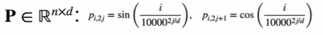

## Korean to English Translation Project

### 1. Project Description
> This project is for translating Korean to English.
> 
  We use two datasets to train our model
  - The dataset comes from kaggle 
    - [Korean - English Parallel Corpus](https://www.kaggle.com/datasets/rareloto/naver-dictionary-conversation-of-the-day?resource=download)
    - [1000 parallel sentences](https://www.kaggle.com/datasets/bryanpark/parallelsents)
    - `kaggle datasets download -d rareloto/naver-dictionary-conversation-of-the-day`
    - `kaggle datasets download -d bryanpark/parallelsents`

>The project run result: 
- 
### 1.1 Model Description
> Use transformer 
> 


  

#### * before optimization

* Multi-Head Attention
  * 
  * use four-head attention(h=4)

* Positional Encoding-(Fixed Positional Encoding)
  * 
  * Each position is encoded as a fixed vector based on sin and cos functions.
* Encode block and Decode block-(N x 2)
  * Both the encoder and the decoder use two blocks


#### * after optimization
* Positional Encoding-(Learnable Position Encoding)
  * Uses a learnable positional encoding
 
   ``` 
  class LearnablePositionalEncoding(nn.Module):
    def __init__(self,num_hiddens,max_len=100):
        super(LearnablePositionalEncoding, self).__init__()
        self.pe=nn.Parameter(torch.randn(1,max_len,num_hiddens))

    def forward(self,x):
        x=x + self.pe[:,x.size(1),:]
        return x 
  ```
* Encode block and Decode block-(N x 3)


> Result comparison   
* Use two hundred sentence cases to test and find the average of the results of bleu

<p float="left">
  
   
</p>

### Score before: 0.767 
### Score after: 0.800
Modified the number of blocks, then changed the position code to a learnable code, and finally made the result better

** **

### 2. Data Description
1. English Parallel Corpus datasets:
- the conversations.csv saved in is as follows：
- 

2. 1000 parallel sentences datasets: 
- the 1000sents.csv saved in is as follows：
- 

We only get the column where the Korean language is and the column where the English language is in the file
，and save it as a selected_conversations.txt file
- The dataset has a total of 6560 sentences


### 3. File Description

- **main/main.py:** the main file of the project

- **main/lib.py:**  the file where the function is stored
- **main/readData.py:** create .txt data file from .csv file
- **data:** the folder where the dataset is stored
- **image:** the folder where the image is stored
- **requirements.txt:** save running environment information


### 4. How to run the code
* Environment setting:
    - python 3.7.16
    - pytorch 1.11.0 gpu
    - pandas 1.2.4
    - numpy 1.21.5

- In principle, only installed torch and numpy can run the code
- if can't run the code, you can:
```pip install -r requirements.txt```
- run the code ```python main.py```
- if you want to train by yourself , you can set the parameter ```train = True``` in the main.py file

### 5. Code Description

> The Transformer model is created using the self-attention mechanism.
Transformer is composed of encoder and decoder.

main.py 
    
* Positionwise feed-forwad network: 

  *PositionWiseFFN()*
  * The shape of the input X (batch size, number of time steps or sequence length, number of hidden units or feature dimension)
  * will be converted by a two-layer perceptron into an output tensor of shape (batch size, number of time steps, ffn_num_outputs)


* Add and Norm:
    
    * nn.LayerNorm()
    * nn.BatchNormld()

* Encoder:
  * EncoderBlock()：The EncoderBlock class contains two sublayers: multi-head self-attention and position-based feedforward networks, both of which use residual connections followed by layer normalization.
  * TransformerEncoder()：Stacked num_layers instances of the EncoderBlock class

* Decoder:
  * DecoderBlock()： Each layer implemented consists of three sublayers: decoder self-attention, "encoder-decoder" attention, and position-based feedforward network
  * TransformerDecoder()：A complete Transformer decoder consisting of num_layers DecoderBlock instances


* hyperparameters：
  * num_hiddens, num_layers, dropout, batch_size, num_steps = 32, 2, 0.1, 64, 10 
  * lr, num_epochs, device = 0.0002, 4000, d2l.try_gpu()
  * ffn_num_input, ffn_num_hiddens, num_heads = 32, 64, 4
  * key_size, query_size, value_size = 32, 32, 32  
  * norm_shape = [32]


    
### 6. References
  - Vaswani, A et al. (2017). Attention is all you need. Advances in neural information processing systems (pp. 5998–6008)
  - Lin et al. (2017). A structured self-attentive sentence embedding. arXiv preprint arXiv:1703.03130.
